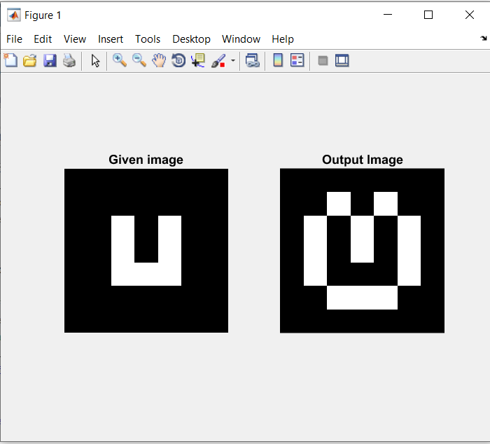
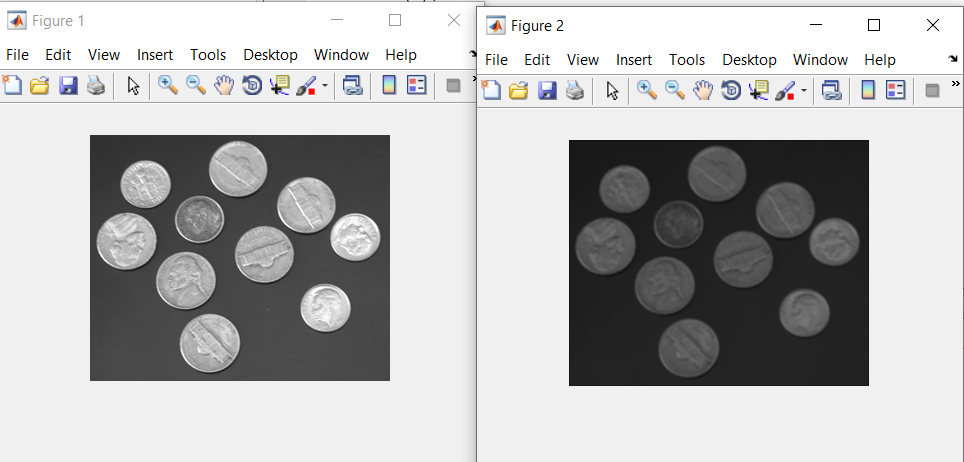

# DigitalImageProcessing
4th year 2nd semester lab Digital Image processing codes are done using MATLAB

## About projects
This Repository consist of 6 projects using WebGL and GLSL. These 6 projects are:
* Slicing Image and Rotating 90 Degree
* Histogram Equalization
* Intensity transformation
* Morphology
* Gaussian 3*3 Filtering
* Different Filtering

### Slicing Image and Rotating 90 Degree
Following steps were performed:
1.	Took two input pictures. 
2.	Took a blank image. 
3.	Divided the blank image into 6 rows.  
4.	Replaced the odd rows with the portion of the first image and even rows with the portion of the second image. 
5.	Then rotated the picture by 90 degrees without using built-in function

The output is shown in the image below.   

### Histogram Equalization
Histogram Equalization is performed on a grey scale image

The output is shown in the image below.   

### Intensity transformation
Following steps were performed:
1. Took a RGB photo 
2. Made it a grayscale image, say I 
3. Calculated and plotted histogram of image I 
4. Applied Negation Transformation on I 
5. Calculated and plotted histogram of the negative image 
6. Took a threshold value input from user, say A = 127 
7. Increased brightness by 50% for pixels with intensity greater than A; else decreased it by 25% of image I 
8. Calculated and plotted histogram of the thresholded image 
9. Applied Log Transformation on image I with c = 1.5 
10. Calculated and plotted histogram of the log transformed image 
11. Take gamma value input was from user, say Y = 0.6 
12. Applied Power Law Transformation on image I with c = 1.5 
13. Calculated and plotted histogram of the Power Law transformed image. 

The output is shown in the image below.   

### Morphology
Following steps were performed:
Generated the “image we want” from the given image. found which structuring element along with its dimension is needed to generate the output image. The given image is generated by using the following matrix: 
[0 0 0 0 0 0 0; 
 0 0 0 0 0 0 0; 
 0 0 1 0 1 0 0; 
 0 0 1 0 1 0 0; 
 0 0 1 1 1 0 0; 
 0 0 0 0 0 0 0; 
 0 0 0 0 0 0 0];

The output is shown in the image below.   

### Gaussian 3*3 Filtering
Following steps were performed:
1.	Took an input image. 
2.  User will give the value of sigma as input. The sigma value i.e., the value of the standard deviation can be any numeric value. The higher the value, the more the image will be blurred.  
3.	Designed a 3X3 gaussian kernel for filtering.   
4.	Make the kernel center based and boundaries were handled using padding

The output is shown in the image below.   

### Different Filtering
Following steps were performed:
1.	Took an input image. 
2.  Applied Laplacian Filter on input image 
3.	Applied Laplacian Enhanced on image of step 2
4.	Applied Sobel Filter on input image
5.  Applied 5X5 average filter mask on output image of step 4
6.  Got the product of output of step 3 and step 5
7.  Added input image and output of step 6.
8.  Apllied Power Law Transform having c=1 and Gamma=0.5.

The output is shown in the image below.   

